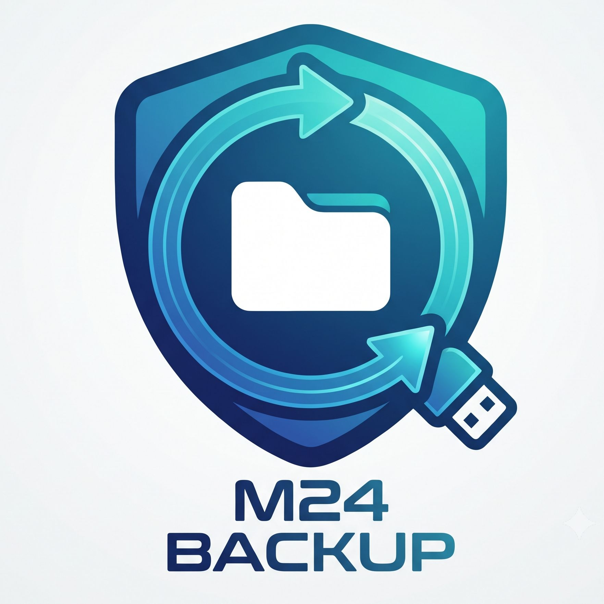

# M24 Backup – Bibliothekssicherung

[English](README.md) | **Deutsch**

<p align="center">
  
</p>

Eine kompakte Windows-Anwendung zum sicheren Sichern und Wiederherstellen der
persönlichen Ordner des angemeldeten Benutzers. Die Oberfläche erscheint auf
deutschsprachigen Windows-Systemen auf Deutsch und auf allen anderen Systemen
auf Englisch.

## Funktionen

- Sichert Desktop, Dokumente, Downloads, Bilder, Musik, Videos, Favoriten,
  gespeicherte Spiele und weitere erkannte Benutzerordner.
- Nutzt Robocopy und löscht keine Dateien aus dem Sicherungsziel.
- Prüft Ziel, freien Speicherplatz und FAT32-Einschränkungen vor dem Start.
- Kann eine Sicherung per Dry-Run simulieren und die geplanten Änderungen im
  Protokoll anzeigen, ohne Nutzdaten zu kopieren.
- Kann zusätzliche frei gewählte Ordner in die Sicherung aufnehmen und über
  gespeicherte Metadaten wiederherstellen.
- Kann ein erfolgreich verwendetes USB-Sicherungslaufwerk anschließend sicher
  auswerfen.
- Zeigt Fortschritt und ein verständliches Ergebnis direkt im Fenster an.
- Öffnet vorhandene Protokolle und Sicherungsordner direkt nach der
  Laufwerkswahl und kann die Ergebnisübersicht kopieren.
- Merkt sich die Ordnerauswahl, zeigt einen Verlauf und kann eine erfolgreiche
  Sicherung durch vollständiges Lesen aller Dateien prüfen.
- Informiert nach Vorgängen über eine Windows-Benachrichtigung, wenn die App im
  Hintergrund liegt.
- Zeigt eine Backup-Ampel mit Alter, Dauer und Ordnerzahl der letzten Sicherung
  auf dem ausgewählten Laufwerk.
- Erkennt das zuletzt erfolgreich verwendete Sicherungslaufwerk anhand seiner
  Datenträger-ID wieder, auch wenn Windows den Laufwerksbuchstaben ändert.
- Erstellt ein lesbares Protokoll und `_Sicherungsinfo.txt` auf dem Ziel.
- Unterstützt kooperatives Abbrechen zwischen den Ordnern.
- Bietet eine defensive Rücksicherung mit Metadatenprüfung, Vorschau und
  ausdrücklicher Bestätigung.
- Läuft ohne Administratorrechte und ohne zusätzliche Laufzeitinstallation.

> [!IMPORTANT]
> Eine Sicherung ist erst verlässlich, wenn eine Rücksicherung stichprobenartig
> geprüft wurde. Während der Wiederherstellung werden neuere lokale Dateien
> geschützt; die Vorschau sollte trotzdem aufmerksam kontrolliert werden.

## Installation

Die empfohlene Variante ist die Setup-Datei aus den
[GitHub Releases](https://github.com/meuse24/m24Backup/releases). Der Installer
installiert die Anwendung ohne Administratorrechte pro Benutzer unter
`%LocalAppData%\Programs\Bibliothekssicherung`, legt einen Startmenüeintrag an
und kann optional eine Desktop-Verknüpfung erstellen.

Alternativ kann das portable ZIP vollständig entpackt und
`Bibliothekssicherung starten.vbs` ausgeführt werden. Die Anwendung darf auch
direkt auf einem Sicherungslaufwerk liegen.

## Bedienung in Kürze

1. Sicherungslaufwerk anschließen und die Anwendung starten.
2. Modus **Sichern** und das gewünschte Ziellaufwerk auswählen.
3. Zu sichernde Ordner markieren, bei Bedarf **Weiteren Ordner...** nutzen
   oder **Nur simulieren (Dry-Run)** aktivieren.
4. Optional **Laufwerk nach Erfolg sicher auswerfen** aktivieren.
5. **Sicherung starten** wählen, den Abschlussstatus prüfen und bei Bedarf das
   Protokoll öffnen.

Für eine Rücksicherung den Modus **Wiederherstellen** wählen. Die Anwendung
akzeptiert nur eine Sicherung, deren Computer- und Benutzerinformationen zum
aktuellen Profil passen. Vor Änderungen erscheint eine Konfliktvorschau.

Die ausführliche Anleitung ist im Projekt und in jeder Distribution enthalten:

- [`docs/help.de.md`](docs/help.de.md) – deutsche Quelle der lokalen HTML-Hilfe
- [`docs/help.en.md`](docs/help.en.md) – englische Quelle der lokalen HTML-Hilfe

## Systemvoraussetzungen

- Windows 10 ab Version 1809 oder Windows 11
- Windows PowerShell 5.1
- .NET Framework mit Windows Forms
- Robocopy

Diese Komponenten sind in unterstützten Windows-Versionen bereits enthalten.

## Datenschutz und Sicherheitsmodell

Die Anwendung arbeitet lokal. Sie überträgt keine Dateien und keine
Nutzungsdaten ins Internet. Sicherungen werden nach Computer und Benutzer
getrennt abgelegt. Bei einer Rücksicherung werden die Sicherungsmetadaten
validiert, bevor lokale Dateien verändert werden. Robocopy-Rückgabecodes werden
ausgewertet; echte Kopierfehler führen nicht zu einem falschen Erfolgshinweis.

Die Skripte werden mit `ExecutionPolicy Bypass` in einem separaten
PowerShell-Prozess gestartet, damit lokale Richtlinien den Start nicht unnötig
verhindern. Das ändert keine systemweite Ausführungsrichtlinie. Release-Dateien
sollten nur aus einer vertrauenswürdigen Quelle bezogen und anhand von
`SHA256SUMS.txt` geprüft werden.

## Entwicklung

Die Anwendung besteht aus Windows PowerShell 5.1, Windows Forms und Robocopy.
Oberfläche und Sicherungs-Worker laufen in getrennten Prozessen und tauschen
atomar geschriebene Status- und JSON-Ergebnisdateien aus. Gemeinsame
Validierungshelfer liegen in `M24Backup.Shared.ps1` und werden von GUI und
Worker geladen.

Lokaler Start:

```powershell
powershell.exe -NoLogo -NoProfile -STA -ExecutionPolicy Bypass `
  -File ".\Bibliothekssicherung-GUI.ps1"
```

Die relativen Starter sind ebenfalls nutzbar:

- `Bibliothekssicherung starten.vbs` – normaler Start ohne Konsolenfenster
- `Bibliothekssicherung starten.bat` – Start für Diagnosezwecke

### Release bauen

Für den Installer wird [Inno Setup 6](https://jrsoftware.org/isinfo.php)
benötigt:

```powershell
winget install --id JRSoftware.InnoSetup -e --scope user
```

Das Release-Skript ermittelt die nächste semantische Version, baut und prüft
alle Artefakte, erstellt und pusht den Git-Tag und veröffentlicht ein
GitHub-Release:

```powershell
.\release.ps1
```

Standardmäßig wird die Patch-Version erhöht (`1.0.0` → `1.0.1`). Für neue
Funktionen oder inkompatible Änderungen wird die Release-Art angegeben:

```powershell
.\release.ps1 -Bump Minor  # 1.0.0 -> 1.1.0
.\release.ps1 -Bump Major  # 1.1.0 -> 2.0.0
```

Den vollständigen Ablauf anzeigen, ohne zu bauen oder GitHub zu verändern:

```powershell
.\release.ps1 -Bump Minor -WhatIf
```

Nur lokal bauen, ohne Tag, Push oder GitHub-Release:

```powershell
.\release.ps1 -Bump Minor -LocalOnly
```

Mit `-Version 1.2.3` kann eine Version ausdrücklich vorgegeben werden. Das
Skript verweigert unsaubere Arbeitsbäume, doppelte Tags, detached HEADs und
Releases von einem Branch, der hinter GitHub liegt. Die fertigen Artefakte
liegen in `dist\`. `build.ps1` bleibt für technische oder rein portable Builds
verfügbar.

## Hinweise zur Veröffentlichung

Die erzeugten Pakete sind derzeit nicht digital signiert. Windows SmartScreen
kann deshalb bei Downloads aus dem Internet warnen. Für eine breitere
öffentliche Verteilung sollten Setup-Datei und Skripte mit einem
vertrauenswürdigen Code-Signing-Zertifikat signiert werden.

Dieses Repository enthält derzeit keine Open-Source-Lizenz. Eine öffentliche
Lesbarkeit des Quellcodes erteilt daher nicht automatisch Nutzungs-, Änderungs-
oder Weiterverteilungsrechte.
